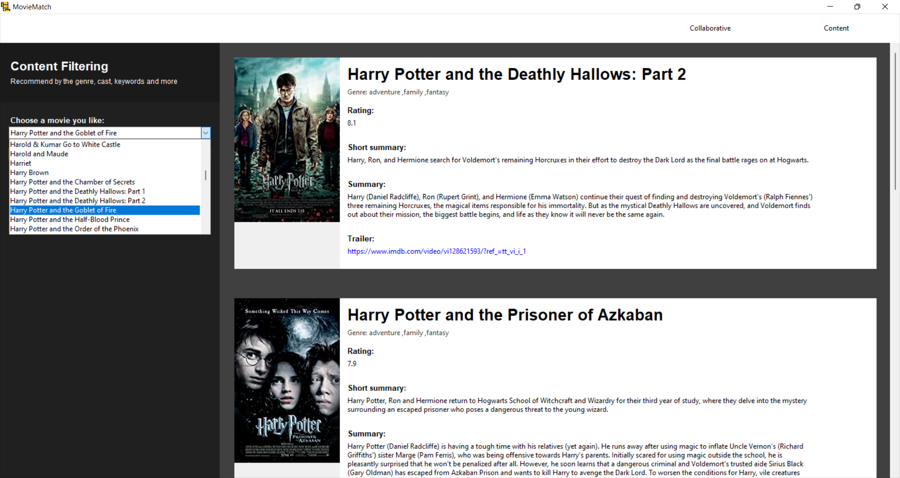

# Projekt: MovieMatch
Projektet tager udgangspunkt i at lave et system som ville kunne  komme med forslag til film basseret på en valgt film. 

Vi har med to slags forslag basseret på de to filtreringstyper: Collaborative-basseret og Content-basseret.

### Teknologier:
- (list of used technologies)

### Installation guide

### User guide

### Status

### Analyse spørgsmål
# MovieMatch

- Er der en sammenhæng mellem genre og ratings? Har brugeren nogle særlige præferencer til rating i forhold til valg af genre? Undersøg cluster-grupperne og se på rating og genre for denne gruppe
- Er der en sammenhæng mellem ratings, revenue og budget? Har brugeren en trang til at skulle se film som har en høj rating og revenue og som har været dyr at producere?
- Er der en sammenhæng mellem rating, budget og runtime? Har brugeren en trang til at skulle se film med en høj rating og budget og som har en lang runtime?

Analyse spørgsmål:
1. Hvilket production companies har den største indtjening?
2. I hvilket land har de den største indtjening?
3. Er der sammenhæng i hvornår en film bliver udgivet på året i forhold til hvor stor indtjening filmen får?
4. Er der en sammenhæng mellem en films budget og dens indtjening?
5. Er der en sammenhæng mellem rating og budget?
6. Vis et bar plot med den gennemsnitlige rating for alle genre
7. Vis et bar plot med den gennemsnitlige indtjening for alle genre
8. Hvilke film har haft den største rating indenfor de sidste 5 år? Hvilken genre tilhører disse film?
